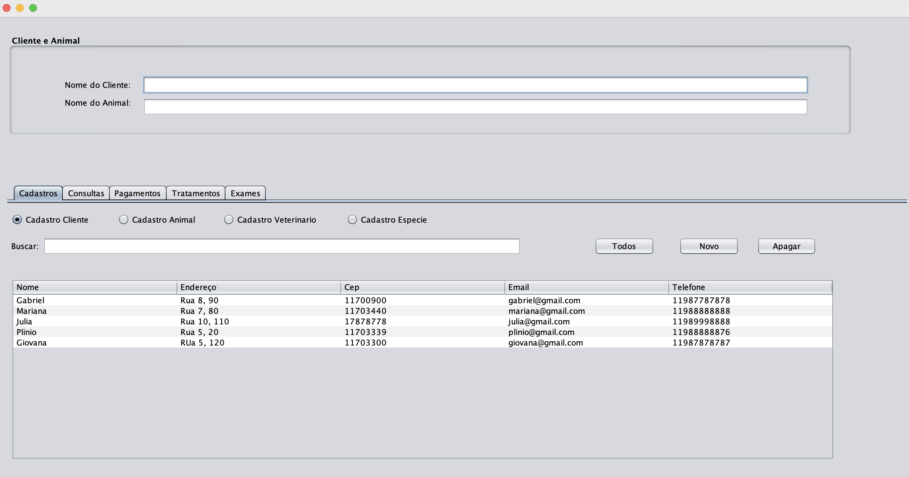
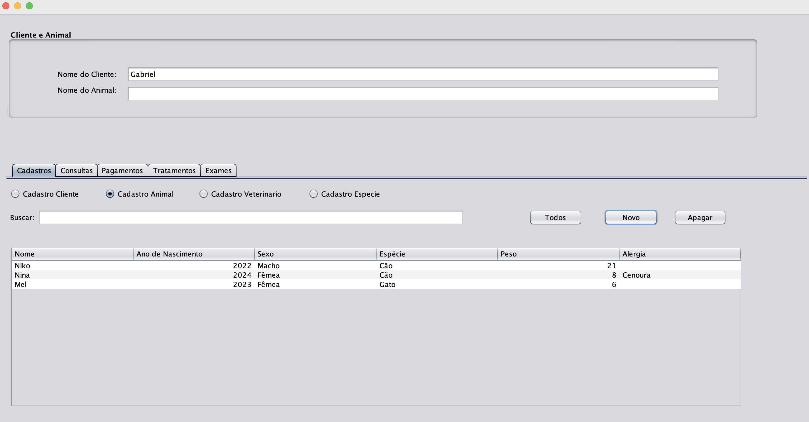
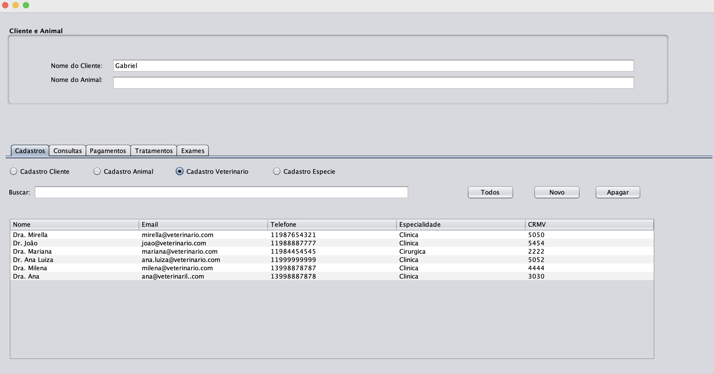
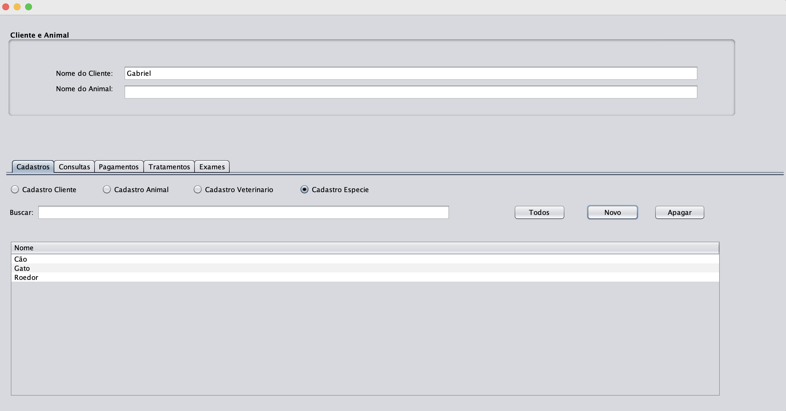
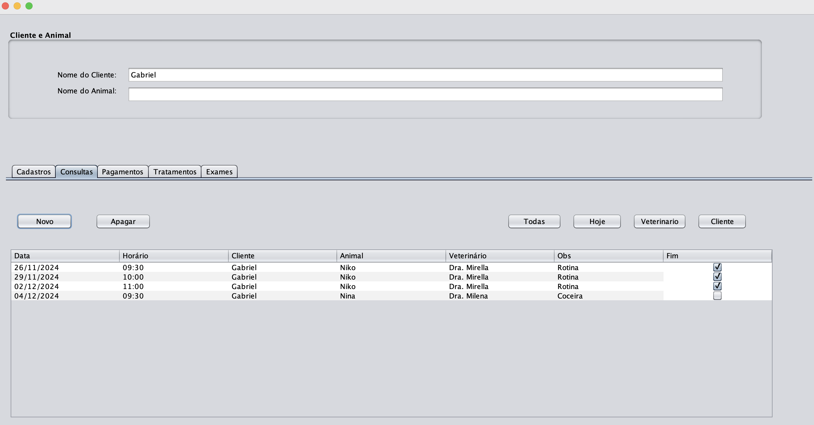
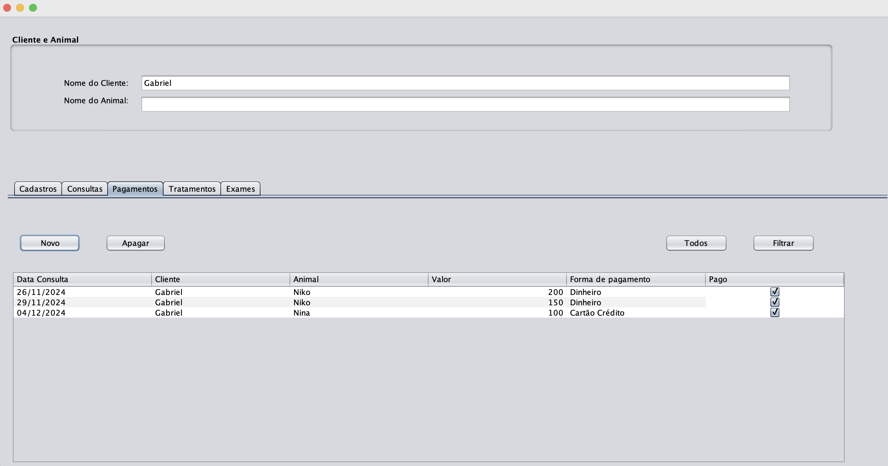
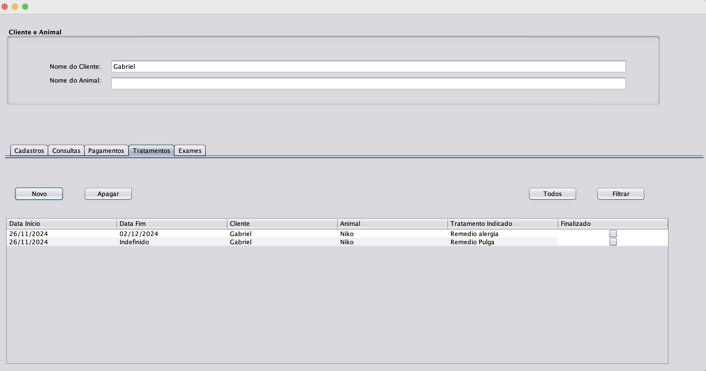
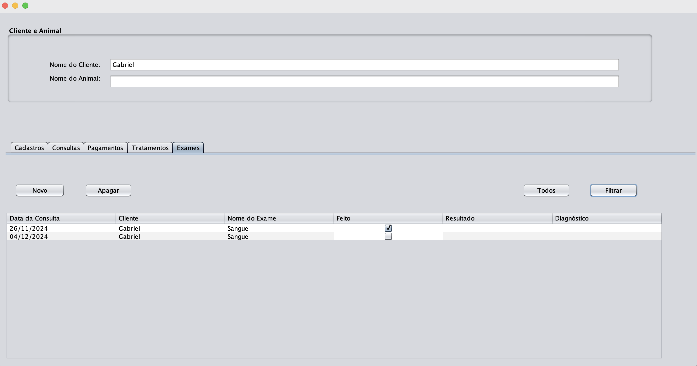

# 🐾 Clínica Veterinária - Sistema em Java

Sistema de gerenciamento para uma Clínica Veterinária, desenvolvido em Java com arquitetura MVC (Model-View-Controller). Permite o controle completo de clientes, animais, veterinários, espécies e o gerenciamento de consultas, tratamentos, exames e pagamentos.

## Funcionalidades

- **Gerenciamento de Clientes:** Adição, visualização, edição e exclusão de registros de clientes.
- **Gerenciamento de Animais:** Adição, visualização, edição e exclusão de registros de animais.
- **Gerenciamento de Veterinários:** Adição, visualização, edição e exclusão de registros de veterinários.
- **Gerenciamento de Espécies:** Adição, visualização, edição e exclusão de registros de espécies.
- **Gerenciamento de Consultas:** Agendamento, visualização, edição e exclusão de consultas relacionadas a um cliente, animal e veterinário.
- **Gerenciamento de Tratamentos:** Adição, visualização, edição e exclusão de tratamentos vinculados às consultas.
- **Gerenciamento de Exames:** Adição, visualização, edição e exclusão de exames solicitados em consultas.
- **Gerenciamento de Pagamentos:** Registro, visualização, edição e exclusão de pagamentos relacionados às consultas.

## Arquitetura

O sistema segue o padrão MVC, dividido em:

- **Model:** Representação dos dados e regras de negócio
- **View:** Interface com o usuário
- **Controller:** Lógica de controle e comunicação entre Model e View

## Tecnologias Utilizadas

- Java (JDK 11+)
- Arquitetura MVC
- Armazenamento local 
- Interface gráfica

## Imagens da Interface

### lientes

---

### Animais

---

### Veterinários

---

### Espécies

---

### Consultas

---

### Pagamentos

---

### Tratamentos

---

### Exames

